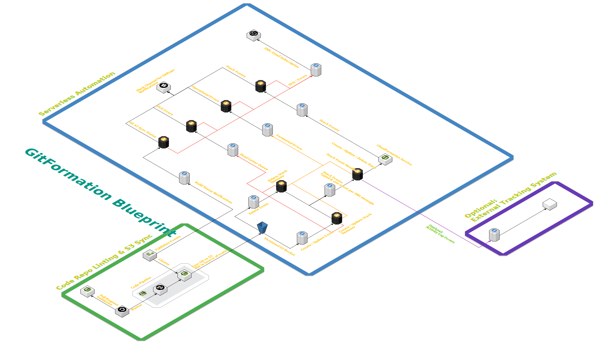

# GitFormation: GitOps for CloudFormation
GitFormation creates, updates, and deletes CloudFormation stacks as they exist in Git and tracks all notifications and 
status updates on Slack

GitFormation operates as a Serverless Application launched via a single SAM stack (Some Roles necessary to launch 
before launching stack).

GitFormation Supports:
* GitHub Repositories (Both Public and Private)
* Deploying stacks to multiple accounts and regions from a single Git Repo.
* Clean separation from Templates and Stacks - allows Templates to be re-used, even across accounts.
* Templates from external buckets (not from the GitOps repo). 
  * This is useful if you have common templates in your org, but many deployments of different GitOps repos that all 
  need to be able to launch the same common template.
* All Notifications, errors, and status updates piped to a named Slack channel.
* Support for Secret stack parameters via SSM.
  * GitFormation will have read access to the value in SSM, and then passes that value to CloudFormation as a parameter 
  - you should only use this when your Template takes the parameter as a `NoEcho` type.
* External SNS Notification Hook (Optional)
  * Allows for external systems (e.g. Change Mgmt & Audit) to track events that GitFormation has initiated. 
* Flexible Security Model.
  * GitFormation creates only very minimal IAM permissions for itself. For all executions against CloudFormation - it 
  assumes a role that you define.
  * GitFormation can work with a single Assumed Role that has access to CloudFormation and can manage certain resource 
  types OR it can work with an Assumed Role that can only work with CloudFormation and where that Role can pass a 
  Service Role to CloudFormation that only CloudFormation can assume. The choice is up to you!
* Custom Tracking Tag
  * All Stacks are automatically tagged with a GitFormation tracking Tag (`GitFormation:stack-file`). The value of the 
  tag is the path to the stack file. You can optionally add a tag value prefix if you have multiple git deployer's 
  running with different permission sets / different accounts so you know where a given stack came from.
 

 # Architecture Diagram
 

# STEPS TO DEPLOY:

**One Time Only**

1.  On the master / governance account, deploy a new stack for the `template-ecr-buildimage.yaml` template.

2.  Build the Docker Image that your GitOps repos themselves use (see [our GitOps repo]
(https://github.com/Lifeway/GitFormation-StacksRepo) that you can use as your base) and push it to the ECR repo created 
by the `template-ecr-buildimage.yaml` stack. e.g: `docker build -t git-deploy .` followed by the instructions provided 
on ECR on how to do an ECR login and push an image.

3.  Run the `make.sh` script.

    In order to run the make script, you will need docker installed.
      * This is a polyglot SAM app that combines Scala, Node, and Python Lambdas. You can build the app without docker, 
      but it is not recommended unless you are doing development / debugging of the application.
      
4.  Package the stack via the aws cli. `aws cloudformation package --template template.yaml  --output-template-file packaged.yaml --s3-prefix cf-deployer --s3-bucket CHANGEME`

**Repeat for each deployer you create**

NOTE - you can skip Step 5 if launching this more than once and have a "master" Deployer deploy the roles for 
"secondary" deployers rather than using a Stack Set:
 
5.  Deploy a StackSet for the master / admin GitFormation stack. Use the `cf-role-master.stackset.yaml` template.

    StackSet:
    * `Name`: Pick a name that makes sense to you.
    * Parameters: see below
    * AccountIds: Every Account you want this deployer to be able to manage
    * Regions: Pick anything. This stack only deploys IAM resources which are global. Thus, you only need to worry 
    about which account ID's to deploy to, the resources created in this stackset will be available in every region.
  
    Parameters: 
    * `CFDeployerRoleName`: This is the name of the Role that will be created in each account the stack set is deployed 
    to. This is a named role. You will provide this name to the deployer SAM stack as a parameter when you launch it so 
    that it knows what Role it needs to assume in each account it is deploying stacks to.
    * `CFServiceRoleName`: This is the name of the CloudFormation Service Role that will be created in each account the 
    stack set is deployed to. This is a named role. You will provide this name to the deployer SAM stack as a parameter 
    when you launch it so that every stack the deployer launches in another account will be launched with this Service 
    Role (this role gets attached to the Stack itself).
    * `DeployerAccountId`: This is the AccountID that the deployer is running in. This is typically your master or 
    governance account.
    * `AutomationStackName`: This is the stack name you will give to the deployer SAM stack when you launch it. This is 
    necessary as part of a semantic naming scheme so that the `CFAccessRole` created in each account is able to get 
    access to the S3 bucket created by the deployer stack. A classic CloudFormation chicken-and-egg problem where the 
    actual `ARN` doesn't exist yet, so a semantic naming scheme must be used so that the IAM access can be setup ahead 
    of the resource being created.
    * `ExternalS3BucketPathArns`: This is optional. If you wish to allow this GitFormation deployer to deploy stacks
    where it is referencing external stack templates (not in the same GitOps repo as the stack), then you must specify
    the S3 Bucket path ARNS.

6.  Deploy the packaged template either via the CLI or via the AWS Console.

    ### Console Instructions & Parameter Details
     
    Main Configuration:
    * `AccountIds` - A comma delimited list of account Id's you want to the deployer to be able to deploy to. **NOTE** 
    this only gives the role assumed by the deployer acesss to do this, however, it will only work if you've first 
    given cross account access to the account the deployer is running in on those account id's. This is handled in 
    Step 1 with the master stackset.
    * `AllowIAMCapabilities` - Enables the passing of the IAM capabilities set to CloudFormation. If this is false, IAM 
    resources cannot be created even if the deployer has full admin access to create any kind of resource. 
    * `CFDeployerRoleName` - The name you provided in step1 above. This is the role the deployer uses in each account 
    to access CloudFormation.
    * `CFServiceRoleName` - OPTIONAL: The name you provided in step1 above. This is the service role passed to 
    CloudFormation by the `CFDeployerRoleName` for actually creating the resources. If this value is not provided, no 
    service role will be passed and the permissions granted by `CFDeployerRoleName` must be wide enough to create the 
    resources necessary by the stacks.
    * `SSMPath` - The path that you are going to grant the deployer access to read values from. NOTE: If you use your 
    own KMS key on a secret value, you must ensure you give the role defined by `CFDeployerRoleName` access to your Key! 
      * e.g. `/cloudformation-automation/admin-deployer/` would result in the deployer being able to read any secret 
      value under that path, for instance: `/cloudformation-automation/admin-deployer/team-x/secret-value` would now be 
      readable by the deployer. 
    * `SemanticStackNaming` - If disabled, users can provide a `StackName` value in their template (semantic naming is 
    always used if no value is present). However, this is highly discouraged as it can be trivially easy to overrite 
    another stack on accident. Thus, this property should be enabled for best practice. When enabled, stacks are named 
    semantically, regardless if a value for `StackName` is provided.
        * For Instance: a stack file defined as such `/stacks/myaccount-name.123456789/divisionxyz/productc/license-service.yaml` 
        would have the stack name of `divisionxyz-productc-license-service`
    * `CodeBuildRepository` - The ECR Repository used by the CodeBuild job on your GitOps repo. You can either supply 
    your own, or use the one created by step 1 above. You should only need one repo for all of your deployers on the 
    same account.

    Git Source:
    * `GithubRepoName` - The name of the repo (As seen on GitHub.com)
    * `GithubRepoOwner` - The owner of the repo (As seen on Github.com)
    * `GitHubToken` - GitHub repository OAuth token - this is a GitHub Personal Access Token. All Git actions will 
    appear as from the owner of this token
    
    Slack and Email Configuration:
    * `SlackChannel` - The name of the slack channel name that is receiving the notifications, e.g. 
    `cloudformation-automation`
    * `SlackWebHookUrl` - The webhook URL that you must setup with Slack for this service that has access to the above 
    channel.
    * `EmailContact` - If Slack is down or messages fail to post to slack, this is the email address that will receive 
    all of the events. **NOTE** An SNS subscription email will be sent upon stack launch, you MUST click the link in 
    the email to subscribe to the data feed, else the messages won't be delievered.
    
    Optional Configuration:
    * `StackChangeSetPrefix` - OPTIONAL: the naming prefix of the stackset created by GitFormation. This is useful if 
    you desire to tightly restrict the deployer to only be able to manage stack sets created by that specific deployer 
    instance.
    * `ExternalNotificationSNSArn` - OPTIONAL: If provided, this is an ARN to an SNS topic where the deployer will 
    publish events to for when it operates on a stack (create / update or delete). This notification event is useful 
    for audit logging and tracking changes.
    * `TrackingTagPrefix` - OPTIONAL: If provided, this value will be prepended to the front of the tracking tag value. 
    The value of the tag is the path to the stack file. You can optionally add a tag value prefix if you have multiple 
    git deployer's running with different permission sets / different accounts so you know where a given stack came 
    from.
    * `ExternalS3BucketPathArns` - OPTIONAL: A comma delimited list of S3 Bucket PATH ARNs to external buckets that can 
    be used by stack templates. must be in this form: arn:aws:s3:::BUCKET_NAME/[optional-sub-path]*. This permission is
    in addition to the one given to the deployer role that executes CloudFormation calls on a given account as 
    GitFormation itself reads your template prior to executing CloudFormation just to ensure the template path was
    valid. This is important as GitFormation gives a descriptive slack error if you gave the wrong template path!
 
    
# Access to GitHub
As the deployer currently only works with GitHub.com you will need to walk thru a few steps to give the deployer access 
to GitHub.

1.  Generate a GitHub Personal Access Token from a GitHub.com user where that user has READ access to the repo the 
deployer is tracking. This access token is used by CodePipeline to gain access to GitHub
2.  For PR building, CodeBuild uses GitHub's OAuth based login. The side effect of this is that you must have initiated 
an OAuth login with Github from CodeBuild using the Console one time, again from a GitHub user that has access. This 
can be a bit of a hassle to setup since it cannot be scripted via CloudFormation. 
    * See these links for instructions from AWS on how to link: https://docs.aws.amazon.com/codebuild/latest/userguide/sample-github-pull-request.html 
    and https://docs.aws.amazon.com/codebuild/latest/APIReference/API_ProjectSource.html
